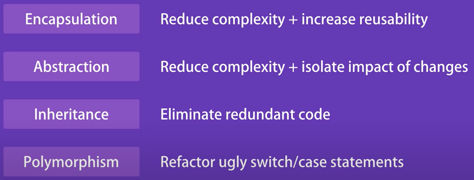

# Objects

The **`Object`** type represents one of [JavaScript's data types](https://developer.mozilla.org/en-US/docs/Web/JavaScript/Data_structures). It is used to store various keyed collections and more complex entities. Objects can be created using the `[Object()](https://developer.mozilla.org/en-US/docs/Web/JavaScript/Reference/Global_Objects/Object/Object)` constructor or the [object initializer / literal syntax](https://developer.mozilla.org/en-US/docs/Web/JavaScript/Reference/Operators/Object_initializer). Any value in JavaScript that is not a string, a number, a Symbol, or true, false, null, or undefined IS AN OBJECT.  And even though strings, numbers, and booleans are not objects, they can behave like immutable objects.

Objects are **mutable** and are manipulated **by reference**. 

Objects inherit the properties of another object, known as `prototype`. Non-inherited properties are described by the term *own property*. 

By default all properties of the objects you create are *writable*, *enumerable*, and *configurable*.
- writable - whether the value of the property can be set
- enumerable - whether the property name is returned by a for/in loop
-configurable - whether the property can be deleted and its attributes edited

# Creating Objects

Objects can be created with 
— object literals
— with the new keyword
— with the Object.create() function

## Object Literals

```jsx
let book = {
"main title": "JavaScript", // These property names include spaces,
"sub-title": "The Definitive Guide", // and hyphens, so use string literals.
for: "all audiences", // for is reserved, but no quotes.
author: { // The value of this property is itself an object.
firstname: "David",
surname: "Flanagan"
}
};
```

## new keyword

The new operator creates and initializes a new object. The new keyword must be followed by a function invocation. A function used in this way is called a constructor and serves to initialize a newly created object. JavaScript includes constructors for its built-in types.

```jsx
let o = new Object(); // Create an empty object: same as {}.
let a = new Array(); // Create an empty array: same as [].
let d = new Date(); // Create a Date object representing the current time
let r = new Map(); // Create a Map object for key/value mapping
```

## prototypes

Every JS object has a second JS object associated with it, which is called `Prototype`. We can refer to it as `Object.prototype`. 

Remember: almost all objects have a prototype, but only a relatively small number of objects have a prototype property. It is these objects with prototype properties that define the prototypes for all the other objects.

Object.prototype has no prototype: it does not inherit any properties.

Other prototype objects are normal objects that do have a prototype. Most built-in constructors (and most user-defined constructors) have a prototype that inherits from Object.prototype. 

EXAMPLE: 
Date.prototype inherits properties FROM Object.prototype, 
so a Date object created by new Date() inherits properties FROM
both Date.prototype and Object.prototype. 
This linked series of prototype objects is known as a prototype chain.

## Object.create()

The **`Object.create()`**  method creates a new object, using an existing object as the prototype of the newly created object.

```jsx
const person = {
  isHuman: false,
  printIntroduction: function() {
    console.log(`My name is ${this.name}. Am I human? ${this.isHuman}`);
  }
};

const me = Object.create(person);

me.name = 'Matthew'; // "name" is a property set on "me", but not on "person"
me.isHuman = true; // inherited properties can be overwritten

me.printIntroduction();
// expected output: "My name is Matthew. Am I human? true"
```

You can pass null to create a new object that does not have a prototype, but if you do this, the newly created object will not inherit anything, not even basic methods like toString() (which means it won’t work with the + operator either).

If you want to create an ordinary empty object (like the object returned by {} or new Object()), pass Object.prototype: 

```jsx
let o3 = Object.create(Object.prototype); // o3 is like {} or new Object().
```

<aside>
⚠️ We will often use Object.create() when we want to guard against modification of an object by a library function that you don’t control. Instead of passing the object itself into the function, you can pass an object that inherits from it, protecting the original object from any changes.

</aside>

# Querying and Setting properties.

To obtain a property use the dot (.) notation or square brackets ([]).

```jsx
let author = book.author; // Get the "author" property of the book.
let name = author.surname; // Get the "surname" property of the author.
let title = book["main title"]; // Get the "main title" property of the book.

// To create or set a property, use a dot or square brackets as you would 
// to query the property, but put them on the lefthand side of an
// assignment expression:

book.edition = 7; // Create an "edition" property of book.
book["main title"] = "ECMAScript"; // Change the "main title" property.
```

## Objects as Associative Arrays

when you access a property of an object with the [] array notation, the name of the property is expressed as a string. Strings are JavaScript datatypes, so they can be manipulated and created while a program is running. So, for example, you can write the following code in JavaScript:

```jsx
let addr = "";
for(let i = 0; i < 4; i++) {
addr += customer[`address${i}`] + "\n";
}
```

This is why array notation is flexible. There are cases when only [] is possible. 

```jsx
// 35. Obyektin seçilən property-sini silən funksiya yazın (məs.: deleteKey(obj, key))
const book = {
    author: "Steven King",
    name: "Shining",
    year: 1977,
    genre: "Horror",
    likeIt: true
}

function deleteKey(obj, key) {
    delete obj[key]
    return obj
}

console.log('__________Task 35__________')
console.log(deleteKey(book, 'genre'))

// My code, this didn't work with the dot notation
```

## Inheritance

JavaScript objects have a set of “own properties,” and they also inherit a set of properties from their prototype object.

```jsx
let o = {}; // o inherits object methods from Object.prototype
o.x = 1; // and it now has an own property x.
let p = Object.create(o); // p inherits properties from o and Object.prototype
p.y = 2; // and has an own property y. 
let q = Object.create(p); // q inherits properties from p, o, and...
q.z = 3; // ...Object.prototype and has an own property z.
let f = q.toString(); // toString is inherited from Object.prototype
q.x + q.y // => 3; x and y are inherited from o and p
```

Now suppose you assign to the property x of the object o. If o already has an own (non-inherited) property named x, then the assignment simply changes the value of this existing property. Otherwise, the assignment creates a new property named x on the object o. If o previously inherited the property x, that inherited property is now hidden by the newly created own property with the same name.

The fact that inheritance occurs when querying properties but not when setting them is a key feature of JavaScript because it allows us to selectively override inherited properties:

```jsx
let unitcircle = { r: 1 }; // An object to inherit from
let c = Object.create(unitcircle); // c inherits the property r
c.x = 1; c.y = 1; // c defines two properties of its own
c.r = 2; // c overrides its inherited property
unitcircle.r // => 1: the prototype is not affected
```

## Property access Errors

It is not an error to query a property that does not exist. If the property  is not found as an own property or an inherited property of o, the property access expression o.x evaluates to undefined. 

```jsx
book.subtitle // => undefined: property doesn't exist
```

However, to attempt to query a property of an object that does not exist. The null and undefined values have no properties, and it is an error to query properties of these values.

```jsx
let len = book.subtitle.length; // !TypeError: undefined doesn't have length
```

two ways to guard against this kind of problem:

```jsx
// A verbose and explicit technique
let surname = undefined;
if (book) {
	if (book.author) {
		surname = book.author.surname;
	}
}
// A concise and idiomatic alternative to get surname or null or undefined
surname = book && book.author && book.author.surname;

// or you can do this 
let surname = book?.author?.surname;
```

# Deleting properties.

The `delete` operator removes a property from an object. `delete` does not operate on the value of the property but on the property itself

```jsx
delete book.author; // The book object now has no author property.
delete book["main title"]; // Now it doesn't have "main title", either.
```

The delete operator only deletes own properties, not inherited ones. To delete an inherited property, you must delete it from the prototype object in which it is defined. Doing this affects every object that inherits from that prototype.)

```jsx
let o = {x: 1}; // o has own property x and inherits property toString
delete o.x // => true: deletes property x
delete o.x // => true: does nothing (x doesn't exist) but true anyway
delete o.toString // => true: does nothing (toString isn't an own property)
delete 1 // => true: nonsense, but true anyway
```

delete does not remove properties that have a configurable attribute of false. Certain properties of built-in objects are non-configurable, as are properties of the global object created by variable declaration and function declaration.

```jsx
// In strict mode, all these deletions throw TypeError instead of returning false
delete Object.prototype // => false: property is nonconfigurable
var x = 1; // Declare a global variable
delete globalThis.x // => false: can't delete this property
function f() {} // Declare a global function
delete globalThis.f // => false: can't delete this property either
```

# Testing Properties

Object is basically a set of properties. Sometimes we need to check whether it has certain properties or not. 

### in operator

The in operator expects a property name on its left side and an object on its right. It returns true if the object has an own property or an inherited property by that name:

```jsx
let o = { x: 1 };
"x" in o // => true: o has an own property "x"
"y" in o // => false: o doesn't have a property "y"
"toString" in o // => true: o inherits a toString property
```

Instead of using the in operator, it is often sufficient to simply query the property and use !== to make sure it is not undefined:

```jsx
let o = { x: 1 };
o.x !== undefined // => true: o has a property x
o.y !== undefined // => false: o doesn't have a property y
o.toString !== undefined // => true: o inherits a toString
```

<aside>
⛔ HOWEVER in can distinguish between properties that do not exist and properties that exist but have been set to undefined.

</aside>

```jsx
let o = { x: undefined }; // Property is explicitly set to undefined
o.x !== undefined // => false: property exists but is undefined
o.y !== undefined // => false: property doesn't even exist
"x" in o // => true: the property exists
"y" in o // => false: the property doesn't exist
delete o.x; // Delete the property x
"x" in o // => false: it doesn't exist anymore
```

### hasOwnProperty() method

```jsx
let o = { x: 1 };
o.hasOwnProperty("x") // => true: o has an own property x
o.hasOwnProperty("y") // => false: o doesn't have a property y
o.hasOwnProperty("toString") // => false: toString is an inherited property
```

### propertyIsEnumerable

Refines hasOwnProperty: It returns true only if the named property is an own property and its enumerable attribute is true. Certain built-in properties are not enumerable. Properties created by normal JavaScript code are enumerable unless you’ve used one of the techniques to make them non-enumerable.

```jsx
let o = { x: 1 };
o.propertyIsEnumerable("x") // => true: o has an own enumerable property x
o.propertyIsEnumerable("toString") // => false: not an own property
Object.prototype.propertyIsEnumerable("toString") // => false: not enumerable
```

# Enumerating Properties

The for/in loop: It runs the body of the loop once for each enumerable property (own or inherited) of the specified object, assigning the name of the property to the loop variable. Built-in methods that objects inherit are not enumerable, but the properties that your code adds to objects are enumerable by default. 

```jsx
let o = {x: 1, y: 2, z: 3}; // Three enumerable own properties
o.propertyIsEnumerable("toString") // => false: not enumerable
for(let p in o) { // Loop through the properties
console.log(p); // Prints x, y, and z, but not toString
}
```

To guard against enumerating inherited properties with for/in, you can add an explicit check inside the loop body:

```jsx
for(let p in o) {
if (!o.hasOwnProperty(p)) continue; // Skip inherited properties
}
for(let p in o) {
if (typeof o[p] === "function") continue; // Skip all methods
}
```

Alternative to `for / in` : 
create an array of property names and then loop that array with `for / of` 

How to create and array of property names: 

1. `Object.keys()` returns an array of the names of the enumerable own properties of an object. It does not include non-enumerable properties, inherited properties, or properties whose name is a Symbol.
2. `Object.getOwnPropertyNames()` works like `Object.keys()` but returns an array of the names of nonenumerable own properties as well, as long as their names are strings.
3. `Object.getOwnPropertySymbols()` returns own properties whose names are Symbols, whether or not they are enumerable.
4. `Reflect.ownKeys()` returns all own property names, both enumerable and non-enumerable, and both string and Symbol.

## Property Enumeration Order \\\

??? Not clear yet

# Extending Objects

How to copy the properties of one object to another object.

```jsx
let target = {x: 1}, source = {y: 2, z: 3};
for(let key of Object.keys(source)) {
target[key] = source[key];
}
target // => {x: 1, y: 2, z: 3}
```

In ES6, this ability comes to the core JavaScript language in the form of `Object.assign()`.

`Object.assign()`:

1. Two or more objects as arguments
2. The first argument: target object, it is modified and returned 
3. The second (and other) argument:  the source objects - is not modified
4. For each source object, it copies the enumerable own properties of that object (including those whose names are Symbols) into the target object. It processes the source objects in argument list order so that properties in the first source object override properties by the same name in the target object and properties in the second source object (if there is one) override properties with the same name in the first source object.

Reread this chapter - not very clear… 

# Serializing Objects

Object serialization is the process of converting an object’s state to a
string from which it can later be restored. The functions
JSON.stringify() and JSON.parse() serialize and restore
JavaScript objects.

```jsx
let o = {x: 1, y: {z: [false, null, ""]}}; // Define a test
object
let s = JSON.stringify(o); // s == '{"x":1,"y":{"z":
[false,null,""]}}'
let p = JSON.parse(s); // p == {x: 1, y: {z: [false,
null, ""]}}
```

- Objects, arrays, strings, finite numbers, true, false, and null are supported and can be serialized and restored.
- NaN, Infinity, and -Infinity are serialized to null.
- Date objects are serialized to ISO-formatted date strings, but JSON.parse() leaves these in
string form and does not restore the original Date object.
- Function, RegExp, and Error objects and the undefined value cannot be serialized or restored.
- JSON.stringify() serializes only the enumerable own properties of an object. If a property value cannot be serialized, that property is simply omitted from the stringified output.

Both JSON.stringify() and JSON.parse() accept optional second arguments…

# Object Methods

## toString()

The toString() method takes no arguments; it returns a string that somehow represents the value of the object on which it is invoked.
The default toString() method is not very informative.

```jsx
let s = { x: 1, y: 1 }.toString(); // s == "[object Object]"
```

Because this default method does not display much useful information, many classes define their own versions of toString():
- when an array is converted to a string, you obtain a list of the array elements, themselves each converted to a string
- when a function is converted to a string, you obtain the source code for the function. 

You might define your own toString() method like this:

```jsx
let point = {
x: 1,
y: 2,
toString: function() { return (${this.x}, ${this.y}); }
};
String(point) // => "(1, 2)": toString() is used for string conversions
```

## toLocaleString() \\

## valueOf() \\

## toJSON()

Object.prototype does not actually define a toJSON() method, but the JSON.stringify() method looks for a toJSON() method on any object it is asked to serialize. If this method exists on the object to be serialized, it is invoked, and the return value is serialized, instead of the original object. The Date class defines a toJSON() method that returns a serializable string representation of the date. 

```jsx
let point = {
x: 1,
y: 2,
toString: function() { return (${this.x}, ${this.y});
},
toJSON: function() { return this.toString(); }
};
JSON.stringify([point]) // => '["(1, 2)"]'
```

# Extended Object Literal Syntax \\\

## Spread Operator

you can copy the properties of an existing object into a new object using the “spread operator” ... inside an object literal

```jsx
let position = { x: 0, y: 0 };
let dimensions = { width: 100, height: 75 };
let rect = { ...position, ...dimensions };
rect.x + rect.y + rect.width + rect.height // => 175
```

Note that this ...syntax is often called a spread operator but is not a true JavaScript operator in
any sense. Instead, it is a special-case syntax available only within object literals. (Three dots are used for other purposes in other JavaScript contexts, but object literals are the only context where the three dots cause this kind of interpolation of one object into another one.)

If the object that is spread and the object it is being spread into both have a property with the same name, then the value of that property will be the one that comes last:

```jsx
let o = { x: 1 };
let p = { x: 0, ...o };
p.x // => 1: the value from object o overrides the initial
value
let q = { ...o, x: 2 };
q.x // => 2: the value 2 overrides the previous value from
o.
```

It only spreads the *own properties* of an object, not any inherited ones:

```jsx
let o = Object.create({x: 1}); // o inherits the property x
let p = { ...o };
p.x // => undefined
```

<aside>
⛔ Spread operator can represent a substantial amount of work to the JavaScript interpreter. If an object has n properties, the process of spreading those properties into another object is likely to be an O(n) operation. This means that if you find yourself using ... within a loop or recursive function as a way to accumulate data into one large object, you may be writing an inefficient O(n^2) algorithm that will not scale well as n gets larger.

</aside>

# Object-Oriented Programming

## This and New keywords

| In an object method, this refers to the object. |
| --- |
| Alone, this refers to the global object. |
| In a function, this refers to the global object. |
| In a function, in strict mode, this is undefined. |
| In an event, this refers to the element that received the event. |
| Methods like call(), apply(), and bind() can refer this to any object. |

## FOUR PILLARS



### ENCAPSULATION

We combine functions and variables into units which we call objects;

The functions are methods and variables are properties. 

For examples: if we imagine a car as an object its properties are its make, its size, its colours, but the methods are stop(), move(), turn();

In OOP we group related variables and functions that operate on them into objects and this is what we call encapsulation!

Let’s compare a procedural implementation and OOP.

This is procedural 


This is OOP

This is better because the function doesn’t have parameters.


### ABSTRACTION

Its main goal is to handle complexity by hiding unnecessary details from the user. That enables the user to implement more complex logic on top of the provided abstraction without understanding or even thinking about all the hidden complexity.

Making coffee with a coffee machine is a good example of abstraction. You need to know how to use your coffee machine to make coffee. You need to provide water and coffee beans, switch it on and select the kind of coffee you want to get. The thing you don’t need to know is how the coffee machine is working internally to brew a fresh cup of delicious coffee. You don’t need to know the ideal temperature of the water or the amount of ground coffee you need to use.


Let’s imagine that we want to change the private (inner) methods. None of these changes will leak to the outside, because no code touches these functions outside of the object.

### INHERITANCE

Mechanism that allows to get rid of redundant code.


HTML example: for all the elements on the bottom there are properties (hidden and innerHTML) and matters (click() and focus(). Instead of redefining all these properties for each HTML element we can define the, once in a generic object called HTMLElement and make all other objects inherit these properties and methods. It helps us eliminate redundant code!

### POLYMORPHISM

D**escribes situations in which something occurs in several different forms**. In computer science, it describes the concept that you can access objects of different types through the same interface.

## Objects: fundamental information

### OBJECT LITERALS

In the next example: radius, location are properties… Draw is a method.

```jsx
const circle = {
radius:1;
location: {
x:1,
y:1}
draw: function() {
console.log('draw');
}
};

circle.draw();

```

### FACTORIES

If you want to create another circle object (look up) you will have to duplicate the code and if the original code had any bugs you will have to go back and fix the bug in multiple places WHICH isn’t ideal! If an object has one or more methods we say that object has behavior. Basically don't use object literals if your object has behavior.

The solution is to use a factory function.

```jsx
function createCircle(radius) {
	return {
		radius, 
		draw: function() { console.log('draw');
}
};
}

const circle = createCircle(1);
circle.draw(); 
```

### CONSTRUCTORS

The first letter should be uppercase.

```jsx
function Circle(radius) {
this.radius = radius;
this.draw = function() {
console.log('draw');
}
}

cconst anotherCircle = new Circle(1)

// What happens when we call the 'new' keyword
// 1. It creates an empty object
// 2. It sets 'this' keyword to point to that object
// 3. It will return that object from this function
```

### Constructor Property

Every object in JS has a property called constructor - function used to create that object.

When we create an object using the object literals - internally JS uses object constructor to create it.

```jsx
let x = {} // what you write 

let x = new Object() // what JS actually does 
```

We have these constructor for other types too(new String(); new Boolean(); new Number())

### Functions are Objects


Blue icons are methods. Purple icons are properties. This proves that functions are objects as well, cause they have properties and methods.

```jsx
// In JavaScript, functions are objects. 
// They have properties and methods. 
Circle.name; 
Circle.length;
Circle.constructor; // returns Function()
Circle.call({}, 1); // to call the Circle function 
// the first argument is target of this
// second, third, etc. are parameters 
Circle.apply({}, [1]);
```

```jsx
// this is the illustration of what happens internally

const Circle1 = new Function('radius', `
this.radius = radius;
this.draw = function() {
console.log('draw');
}
`)
```


### Adding or Removing Properties

```jsx
// JavaScript objects are dynamic. You can add/remove properties: 
circle.location = {x: 1};
circle['location'] = {x: 1};

// Why use bracket notation instead of a dot?
// 1: When you want to dynamically access a property name.
// 2: When you are using the property names that are not valid identifiers. EXAMPLE:

const propertyName  = 'center-location';
circle.center-location // doesn't work!!!
circle.['center-location'] // this works
                      
delete circle.location;
```

### Enumerating Properties

```jsx
// To enumerate the members in an object: 
for (let key in circle) console.log(key, circle[key]);

Object.keys(circle); 
                      
// To see if an object has a given property
if ('location' in circle)
```

### Abstraction

```jsx
// Abstraction means hiding the complexity/details and showing only the essentials. 
// We can hide the details by using private members. Replace "this" with "let". 

function Circle(radius) { 
   // Public member - an object property
   this.radius = radius; 

   // Private member - a local variable                    
   let defaultLocation = {};                      
}
```

Scope refers to the part of a program where we can access a variable. JavaScript allows us to nest scopes, and variables declared in outer scopes are accessible from all inner ones. Variables can be globally-, module-, or block-scoped.

A closure is a function enclosed with references to the variables in its outer scope. Closures allow functions to maintain connections with outer variables, even outside the scope of the variables.

There are many uses of closures, from creating class-like structures that store state and implement private methods to passing callbacks to event handlers.

### Getters and Setters

```jsx
// To define a getter/setter, use Object.defineProperty():

Object.defineProperty(this, 'defaultLocation', {
    get: function() { return defaultLocation; },
    set: function(value) { defaultLocation = value; }
});
```

### Stopwatch Exercise

```jsx
function Stopwatch() { 
  let startTime, endTime, running, duration = 0;

  this.start = function() {
    if (running) 
      throw new Error('Stopwatch has already started.');
    
    running = true; 

    startTime = new Date();
  };

  this.stop = function() {
    if (!running) 
      throw new Error('Stopwatch is not started.');

    running = false; 
      
    endTime = new Date();

    const seconds = (endTime.getTime() - startTime.getTime()) / 1000;
    duration += seconds; 
  };

  this.reset = function() { 
    startTime = null;
    endTime = null;
    running = false; 
    duration = 0; 
  };

  Object.defineProperty(this, 'duration', {
    get: function() { return duration; }
  });
}
```

## Inheritance

Two types of inheritance: prototypical and classical.

In JavaScript we have prototypical inheritance. 

A prototype is a parent of another object. Prototype = parent basically. Every single object in JS has a prototype. It inherits all the members found in its prototype.

The only object that DOESN’T HAVE A PROTOTYPE is the root object.

```jsx
// Every object (except the root object) has a prototype (parent). 
// To get the prototype of an object:
Object.getPrototypeOf(obj); 

// You can check if prototypes of two objects are the same or not:
Object.getPrototypeOf(obj) === Object.getPrototypeOf(obj2)
// output boolean

// In Chrome, you can inspect "__proto__" property. But you should 
// not use that in the code.
```

### Property Descriptors

```jsx
// To get the attributes of a property:
Object.getOwnPropertyDescriptor(obj, 'propertyName');

// To set the attributes for a property:
Object.defineProperty(obj, 'propertyName', {
    configurable: false,    // cannot be deleted
    writable: false, // cannot be overwritten 
    enumerable: false // won't be seen in Object.keys
});

// For all the properties we create these attributes are true
// But for all the properties that are inherited - they are false, that's why we can't see them / change them / delete them
```

### Constructor Prototypes

```jsx
// Constructors have a "prototype" property. It returns the object 
// that will be used as the prototype for objects created by the constructor. 
Object.prototype === Object.getPrototypeOf({})
Array.prototype === Object.getPrototypeOf([])

// All objects created with the same constructor will have the same prototype. 
// A single instance of this prototype will be stored in the memory. 
const x = {};
const y = {};
Object.getPrototypeOf(x) === Object.getPrototypeOf(y); // returns true 

// Any changes to the prototype will be immediately visible to all objects 
// referencing this prototype.
```


We made an object with object literals. This object has a prototype.

When we made it with {} under the hood the `new Object()` constructor was used. If we look at the prototype of this Object constructor - it is the same as the obj prototype. They are accessing the same object in the memory.

The same example with Arrays ⬇


### Prototype vs Instance Members

```jsx
// When dealing with large number of objects, it's better to put their
// methods on their prototype. This way, a single instance of the methods
// will be in the memory. ⬇

function Circle(radius) {
// Instance Members
	this.radius = radius
	this.move = function () {
	  console.log('moving')
  }
}

Circle.prototype.draw = function() {
// Prototype Members
	console.log('draw')
}

const c1 = new Circle(1) 
// This object only has radius property 
// draw() is now inside the prototype 
// We can still access it easily 
c1.draw()

// We can also overwrite methods in the prototype
// For examples, let's overwrite the toString() method.
c1.toString()
// Normally it will return "[object Object]"

// Now let's overwrite it 
Circle.prototype.toString = function() {
	return `Circle with radius ${this.radius}`
}

c1.toString()
// Now it will return "Circle with radius 1"
// What happens is, JS first looks at the properties of our object,
// it doesn't find the toString() method, so it goes to the prototype
// It finds it there and uses it.
// Even though we have another implementation of the toString() method on objectBase,
// the new implementation will be used because it's more accessible 
```

### How to iterate over Instance vs Prototype members

```jsx
// To get the own/instance properties:
Object.keys(obj);

Object.keys(c1) // This will give us ["radius", "move"], 
// because it doesn't see the prototype
// So you won't see draw() method here 

// To get all members (instance + prototype): 
for (let key in obj) {}

for (let key in c1) console.log(key)
// radius
// draw 
// move
// This loop will give you all members
```

### Avoid extending the Built-in Objects

A rule to follow: don’t modify objects you don’t own!

The example below is A HUGE MISTAKE

```jsx
// DON'T DO THIS!!!
Array.prototype.shuffle = function() {
	// ...
}

const array = []
array.shuffle();

// Previously we made our own Constructors adn we modified their prototypes 
// That is allowed, you are modifying an object that YOU created

// In this example however you are modifying the object that YOU DON'T OWN!
// You don't own Array!!!
```

## Prototypical Inheritance

### Creating your own Prototypical Inheritance

```jsx
// up until this point we were working on the Circle shape 
// all the properties we made and the methods...
// but what if we want to have other shapes in our program
// shapes that will have the same methods and properties
// that is why we are making Shape() and putting everything into it 

function Shape() {}
function Circle() {}

// Prototypical inheritance 
// in the previous line of code - circle inherits from object
Circle.prototype = Object.create(Shape.prototype);
// here we are resetting the constructor 
Circle.prototype.constructor = Circle; 

// if we didn't reset the circle.prototype.constructor 
// everytime we write new Circle(1) we get the Shape
// after you reset the constructor as well you don't have that problem 
```

### Calling the Super Constructor

```jsx
function Rectangle(color) {
    // To call the super constructor 
    Shape.call(this, color);
}
```

### Intermediate Function Inheritance

```jsx

```

### Method Overriding

```jsx
// Method overriding 
Shape.prototype.draw = function() {}
Circle.prototype.draw = function() {
    // Call the base implementation 
    Shape.prototype.draw.call(this);

    // Do additional stuff here 
}
```

### Polymorphism

# Practical Tasks

## Create a clone of an object

Using the object spread operator `...`, the object's own enumerable properties can be copied into the new object. This creates a shallow clone of the object.

```jsx
const obj = { a: 1, b: 2 }
const shallowClone = { ...obj }
```

With this technique, prototypes are ignored. In addition, nested objects are not cloned, but rather their references get copied, so nested objects still refer to the same objects as the original. Deep-cloning is much more complex in order to effectively clone any type of object (Date, RegExp, Function, Set, etc) that may be nested within the object.

Other alternatives include:

- `JSON.parse(JSON.stringify(obj))` can be used to deep-clone a simple object, but it is CPU-intensive and only accepts valid JSON (therefore it strips functions and does not allow circular references).
- `Object.assign({}, obj)` is another alternative.
- `Object.keys(obj).reduce((acc, key) => (acc[key] = obj[key], acc), {})` is another more verbose alternative that shows the concept in greater depth.

## Compare two objects

For a quick solution use `JSON.stringify()`

But the order is very important, it has to be the same.

```jsx
JSON.stringify(one) === JSON.stringify(two); // true
```

More difficult solution

```jsx
function isDeepEqual(obj1, obj2, testPrototypes = false) {
  if (obj1 === obj2) {
    return true
  }

  if (typeof obj1 === "function" && typeof obj2 === "function") {
    return obj1.toString() === obj2.toString()
  }

  if (obj1 instanceof Date && obj2 instanceof Date) {
    return obj1.getTime() === obj2.getTime()
  }

  if (
    Object.prototype.toString.call(obj1) !==
      Object.prototype.toString.call(obj2) ||
    typeof obj1 !== "object"
  ) {
    return false
  }

  const prototypesAreEqual = testPrototypes
    ? isDeepEqual(
        Object.getPrototypeOf(obj1),
        Object.getPrototypeOf(obj2),
        true
      )
    : true

  const obj1Props = Object.getOwnPropertyNames(obj1)
  const obj2Props = Object.getOwnPropertyNames(obj2)

  return (
    obj1Props.length === obj2Props.length &&
    prototypesAreEqual &&
    obj1Props.every(prop => isDeepEqual(obj1[prop], obj2[prop]))
  )
}
```