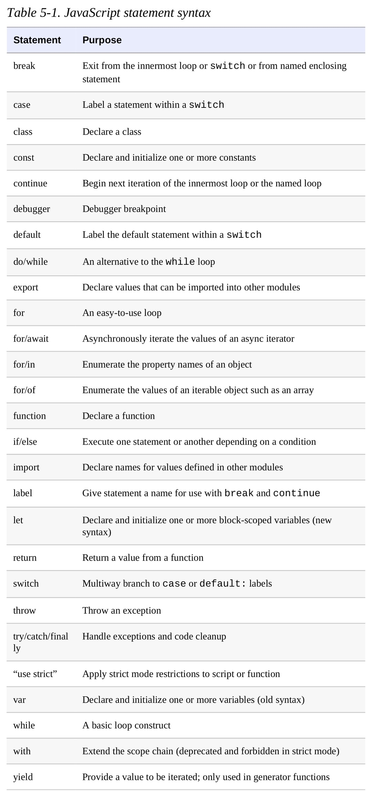

# Expression Statements

The simplest statements. They have side effects.

```jsx
greeting = "Hello " + name;
i *= 3; //assignment
delete o.x;
console.log(debugMessage);

```

# Compound and Empty Statements

A statement block combines multiple statements into a single compound statement. A statement block is simply a sequence of statements enclosed within curly braces. 

Be careful with the semicolon.

```jsx
if ((a === 0) || (b === 0)); // Oops! This line does nothing...
o = null; // and this line is always executed.
```

When you intentionally use the empty statement, it is a good idea to
comment your code in a way that makes it clear that you are doing it on
purpose. For example:

```jsx
for(let i = 0; i < a.length; a[i++] = 0) /* empty */ ;
```

# Conditionals

## if

**An** `if` **statement is used to make the program take a route, or another, depending on the result of an expression evaluation.**

```jsx
if (true) {
// do something
}
// on the contrary, this is never executed:
if (false) {
// do something (? never ?)
}
```

In this form, expression is evaluated. If the resulting value is truthy, statement is executed. If expression is falsy, statement is not executed.

JavaScript syntax requires a single statement after the if keyword and parenthesized expression, but you can use a statement block to combine multiple statements into one.

```jsx
if (!address) {
address = "";
message = "Please specify a mailing address.";
}
```

The second form of the if statement introduces an else clause that is executed when expression is false.

```jsx
if (n === 1)
console.log("You have 1 new message.");
else
console.log(`You have ${n} new messages.`);
```

When you have nested if statements with else clauses, some caution is required to ensure that the else clause goes with the appropriate if statement.

```jsx
i = j = 1;
k = 2;
if (i === j)
	if (j === k)
		console.log("i equals k");
else
	console.log("i doesn't equal j"); // WRONG!!
```

So use curly braces to avoid mistakes like these.

## else if

The if/else statement evaluates an expression and executes one of two pieces of code, depending on the outcome.

```jsx
if (n === 1) {
// Execute code block #1
} else if (n === 2) {
// Execute code block #2
} else if (n === 3) {
// Execute code block #3
} else {
// If all else fails, execute block #4
}
```

## switch

```jsx
switch(n) {
case 1: // Start here if n === 1
// Execute code block #1.
break; // Stop here
case 2: // Start here if n === 2
// Execute code block #2.
break; // Stop here
case 3: // Start here if n === 3
// Execute code block #3.
break; // Stop here
default: // If all else fails...
// Execute code block #4.
break; // Stop here
}
```

The `break` statement causes the interpreter to jump to the end (or “break out”) of the switch statement and continue with the statement that follows it. The case clauses in a switch statement specify only the starting point of the desired code; they do not specify any ending point. 

In the absence of `break` statements, a `switch` statement begins executing its block of code at the case label that matches the value of its expression and continues executing statements until it reaches the end of the block. On rare occasions, it is useful to write code like this that “falls through” from one case label to the next, but **99% of the time you should be careful to end every case with a break statement.** 

When using switch inside a function, however, you may use a `return` statement instead of a `break` statement. Both serve to terminate the `switch` statement and prevent execution from falling through to the next case.

Here is a more realistic example of the switch statement; it converts a value to a string in a way that depends on the type of the value:

```jsx
function convert(x) {
	switch(typeof x) {
	case "number": // Convert the number to a hexadecimal integer
		return x.toString(16);
	case "string": // Return the string enclosed in quotes
		return '"' + x + '"';
	default: // Convert any other type in the usual way
		return String(x);
	}
}
```

Because not all of the case expressions are evaluated each time the switch statement is executed, you should avoid using case expressions that contain side effects such as function calls or assignments. **The safest course is simply to limit your case expressions to constant expressions.** 

If none of the case expressions match the switch expression, the switch statement begins executing its body at the statement labeled `default`:. If there is no default: label, the switch statement skips its body altogether.

# Loops

## while

```jsx
while (expression)
statement
```

Another way to say this is that the interpreter executes statement repeatedly while the expression is truthy. You can accidentally create an infinite loop.

```jsx
let count = 0;
while(count < 10) {
console.log(count);
count++;
}
```

## do/while

The do/while loop is like a while loop, except that the loop expression is tested at the bottom of the loop rather than at the top. This means that the body of the loop is always executed at least once. The syntax is:

```jsx
do
statement
while (expression);
```

The do/while loop is less commonly used than its while.

There are a couple of syntactic differences between the do/while loop and the ordinary while loop. The do loop must always be terminated with a semicolon. The while loop doesn’t need a semicolon if the loop body is enclosed in curly braces.

## for

```jsx
for(initialize ; test ; increment)
statement

//explanation ⬇ with a while loop

initialize;
while(test) {
	statement
	increment;
}
```

Using the comma operator is common with for loops.

```jsx
let i, j, sum = 0;
for(i = 0, j = 10 ; i < 10 ; i++, j--) {
sum += i * j;
}
```

The following code uses a for loop to traverse a linked list data structure and return the last object in the list (i.e., the first object that does not have a next property):

```jsx
function tail(o) { // Return the tail of linked list o
for(; o.next; o = o.next) /* empty */ ; // Traverse while o.next is truthy
return o;
}
```

Any of the three expressions may be omitted from a for loop, but the two semicolons are required. If you omit the test expression, the loop repeats forever, and `for(;;)` is another way of writing an infinite loop, like `while(true)`.

## for/of

Arrays, strings, sets, and maps are iterable: they represent a sequence or set of elements that you can loop or iterate through using a for/of loop.

```jsx
let data = [1, 2, 3, 4, 5, 6, 7, 8, 9], sum = 0;
for(let element of data) {
sum += element;
}
sum // => 45
```

If we modify the preceding code by adding the line data.push(sum); inside the loop body, then we create an infinite loop because the iteration can never reach the last element of the array.

### with objects

Objects are not iterable.

Use `for/in` loop for objects, OR…

Use `for/of` with the Object.keys() method.

```jsx
let o = { x: 1, y: 2, z: 3 };
let keys = "";
for(let k of Object.keys(o)) {
keys += k;
}
keys // => "xyz"
```

This iteration of the keys of an object is not live as the array example above was—changes to the object o made in the loop body will have no effect on the iteration. 

If you don’t want keys, but want values, do this:

```jsx
let sum = 0;
for(let v of Object.values(o)) {
sum += v;
}
sum // => 6
```

If you want both keys and values:

```jsx
let pairs = "";
for(let [k, v] of Object.entries(o)) {
pairs += k + v;
}
pairs // => "x1y2z3"
```

`Object.entries()` returns an array of arrays, where each inner array represents a key/value pair for one property of the object. We use **destructuring** assignment in this code example to unpack those inner arrays into two individual variables.

### with strings

Strings are iterable.

```jsx
let frequency = {};
for(let letter of "mississippi") {
	if (frequency[letter]) {
		frequency[letter]++;
	} else {
		frequency[letter] = 1;
	}
}
frequency // => {m: 1, i: 4, s: 4, p: 2}
```

<aside>
💡 Strings are iterated by Unicode codepoint, not by UTF-16
character. The string “I ❤ 🎨” has a .length of 5 (because the two
emoji characters each require two UTF-16 characters to represent). But
if you iterate that string with for/of, the loop body will run three
times, once for each of the three code points “I”, “❤”, and “🎨”

</aside>

### with set and map

Sets: loop runs once for each element of the set. 

```jsx
let text = "Na na na na na na na na Batman!";
let wordSet = new Set(text.split(" "));
let unique = [];
for(let word of wordSet) {
unique.push(word);
}
unique // => ["Na", "na", "Batman!"]
```

Maps: Each time through the iteration, the iterator returns an array whose first element is a key and whose second element is the corresponding value.

```jsx
let m = new Map([[1, "one"]]);
for(let [key, value] of m) {
key // => 1
value // => "one"
}
```

### async iteration (for/await)

```jsx
// Read chunks from an asynchronously iterable stream and
print them out
	async function printStream(stream) {
		for await (let chunk of stream) {
			console.log(chunk);
		}
}
```

## for/in

`for/in` loop works with any object after the `in`.

```jsx
for (variable in object)
statement
```

```jsx
for(let p in o) { // Assign property names of o to variable p
	console.log(o[p]); // Print the value of each property
}
```

JavaScript arrays are simply a specialized kind of object, and array indexes are object properties that can be enumerated with a for/in loop. For example, following the previous code with this line enumerates the array indexes 0, 1, and 2: 

```jsx
for(let i in a) console.log(i);
// Don't use for in for arrays...
```

BUT many programmers prefer to use a `for/of` loop with `Object.keys()` instead of a `for/in` loop.

# Jumps

## break

The break statement, used alone, causes the innermost enclosing loop or switch statement to exit immediately.

```jsx
for(let i = 0; i < a.length; i++) {
if (a[i] === target) break;
}

// code searches the elements of an array for a particular value.
// loop terminates in the normal way when it reaches the end of the array; 
// it terminates with a break statement if it finds 
// what it is looking for in the array:
```

## continue

The continue statement is similar to the break statement. Instead of exiting a loop, however, continue restarts a loop at the next iteration

Can mean different things in different loops:

- In a while loop, the specified expression at the beginning of the loop is tested again, and if it’s true, the loop body is executed starting from the top.
- In a do/while loop, execution skips to the bottom of the loop, where the loop condition is tested again before restarting the loop at the top.
- In a for loop, the increment expression is evaluated, and the test expression is tested again to determine if another iteration should be done.
- In a for/of or for/in loop, the loop starts over with the next iterated value or next property name being assigned to the specified variable.

## return

Recall that function invocations are expressions and that all expressions have values. A return statement within a function specifies the value of invocations of that function.

The return statement can also be used without an expression to make the function return undefined to its caller. For example:

```jsx
function displayObject(o) {
// Return immediately if the argument is null or undefined.
	if (!o) return;
	// Rest of function goes here...
}
```

## yield

The yield statement is much like the return statement but is used only in ES6 generator functions to produce the next value in the generated sequence of values without actually returning:

```jsx
// A generator function that yields a range of integers
function* range(from, to) {
	for(let i = from; i <= to; i++) {
		yield i;
	}
}
```

## throw

An *exception* is a signal that indicates that some sort of exceptional condition or error has occurred. 

To *throw* an exception is to signal such an error or exceptional condition. 

To *catch* an exception is to handle it —to take whatever actions are necessary or appropriate to recover from the exception. 

Exceptions are thrown whenever a runtime error occurs and whenever the program explicitly throws one using the throw statement. Exceptions are caught with the `try/catch/finally`.

Example of throwing an error

```jsx
function factorial(x) {
	// If the input argument is invalid, throw an exception!
	if (x < 0) throw new Error("x must not be negative");
	// Otherwise, compute a value and return normally
	let f;
	for(f = 1; x > 1; f *= x, x--) /* empty */ ;
	return f;
}
factorial(4) // => 24
```

When an exception is thrown, the JavaScript interpreter immediately stops normal program execution and jumps to the nearest exception handler. If there is no handler, it looks at the parent to find it. It goes on until it can find the handler. If it can’t find a handler, the exception will propagate up to the code that invoke the function. The exception is treated as an error and is reported to the user. 

## try/catch/finally

The try/catch/finally statement is JavaScript’s exception handling mechanism. The try clause of this statement simply defines the block of code whose exceptions are to be handled. The try block is followed by a catch clause, which is a block of statements that are invoked when an exception occurs anywhere within the try block. The catch clause is followed by a finally block containing cleanup code that is guaranteed to be executed, regardless of what happens in the try block. Both the catch and finally blocks are optional, but a try block must be accompanied by at least one of these blocks. The try, catch, and finally blocks all begin and end with curly braces. These braces are a required part of the syntax and cannot be omitted, even if a clause contains only a single statement.

```jsx
try {
// Normally, this code runs from the top of the block to the bottom
// without problems. But it can sometimes throw an exception,
// either directly, with a throw statement, or indirectly, by calling
// a method that throws an exception.
}
catch(e) {
// The statements in this block are executed if, and only if, the try
// block throws an exception. These statements can use the local variable
// e to refer to the Error object or other value that was thrown.
// This block may handle the exception somehow, may ignore the
// exception by doing nothing, or may rethrow the exception with throw.
}
finally {
// This block contains statements that are always executed, regardless of
// what happens in the try block. They are executed whether the try
// block terminates:
// 1) normally, after reaching the bottom of the block
// 2) because of a break, continue, or return statement
// 3) with an exception that is handled by a catch clause above
// 4) with an uncaught exception that is still propagating
}
```

A realistic example: 

```jsx
try {
	// Ask the user to enter a number
	let n = Number(prompt("Please enter a positive integer", ""));
	// Compute the factorial of the number, assuming the input is valid
	let f = factorial(n);
	// Display the result
	alert(n + "! = " + f);
}
catch(ex) { // If the user's input was not valid, we end up here
	alert(ex); // Tell the user what the error is
}
```

The finally is not used as often, but can  be useful. It is guaranteed to be executed if any portion of the try block is executed, regardless of how the code in the try block completes. It is generally used to clean up after the code in the try clause.

In the normal case, the JavaScript interpreter reaches the end of the try block and then proceeds to the finally block, which performs any necessary cleanup. If the interpreter left the try block because of a return, continue, or break statement, the finally block is executed before the interpreter jumps to its new destination. 

If an exception occurs in the try block and there is an associated catch block to handle the exception, the interpreter first executes the catch block and then the finally block. If there is no local catch block to handle the exception, the interpreter first executes the finally block and then jumps to the nearest containing catch clause. 

If a finally block itself causes a jump with a return, continue, break, or throw statement, or by calling a method that throws an exception, the interpreter abandons whatever jump was pending and performs the new jump. For example, if a finally clause throws an exception, that exception replaces any exception that was in the process of being thrown. If a finally clause issues a return statement, the method returns normally, even if an exception has been thrown and has not yet been handled.

# Miscellaneous Statements

## with \\\

The with statement runs a block of code as if the properties of a specified object were variables in scope for that code.

```jsx
with (object)
statement
```

This statement creates a temporary scope with the properties of object as variables and then executes statement within that scope.

## debugger

The debugger statement normally does nothing. If, however, a debugger program is available and is running, then an implementation may (but is not required to) perform some kind of debugging action. In practice, this statement acts like a breakpoint: execution of JavaScript code stops, and you can use the debugger to print variables’ values, examine the call stack, and so on.

```jsx
function f(o) {
	if (o === undefined) debugger; // Temporary line for debugging purposes
... // The rest of the function goes here.
}
//when f() is called with no argument, execution will stop, and
// you can use the debugger to inspect the call stack and find out 
// where this incorrect call is coming from
```

## ‘use strict’

- the `with` statement is not allowed
- functions invoked as functions (rather than as methods) have a this value of undefined (In non-strict mode, functions invoked as functions are always passed the global object as their this value.)
- when a function is invoked with call() or apply(), the this value is exactly the value passed as the first argument to call() or apply(). (In non-strict mode, null and undefined values are replaced with the global object and nonobject values are converted to objects.)
- assignments to nonwritable properties and attempts to create new properties on non-extensible objects throw a `TypeError`. (In non-strict mode, these attempts fail silently.)
- code passed to `eval()` cannot declare variables or define functions in the caller’s scope as it can in non-strict mode. Instead, variable and function definitions live in a new scope created for the `eval()`. This scope is discarded when the `eval()` returns
- the Arguments object in a function holds a static copy of the values passed to the function. In non-strict mode, the Arguments object has “magical” behavior in which elements of the array and named function parameters both refer to the same value.
- a `SyntaxError` is thrown if the delete operator is followed by an unqualified identifier such as a variable, function, or function parameter. (In non-strict mode, such a delete expression does nothing and evaluates to false.)
- In strict mode, an attempt to delete a nonconfigurable property throws a `TypeError`. (In non-strict mode, the attempt fails and the delete expression evaluates to false.)
- it is a `SyntaxError` for an object literal to define two or more properties by the same name. (In non-strict mode, no error occurs.)
- it is a`SyntaxError`  for a function declaration to have two or more parameters with the same name. (In non-strict mode, no error occurs.)
- octal integer literals (beginning with a 0 that is not followed by an x) are not allowed. (In non-strict mode, some implementations allow octal literals.)
- the identifiers `eval` and arguments are treated like keywords, and you are not allowed to change their value. You cannot assign a value to these identifiers, declare them as variables, use them as function names, use them as function parameter names, or use them as the identifier of a catch block.
- the ability to examine the call stack is restricted. `arguments.caller` and `arguments.callee` both throw a `TypeError` within a strict mode function. Strict mode functions also have caller and arguments properties that throw `TypeError` when read. (Some implementations define these nonstandard properties on non-strict functions.)

# Summary

